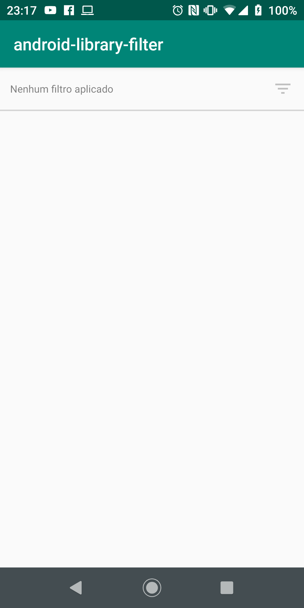
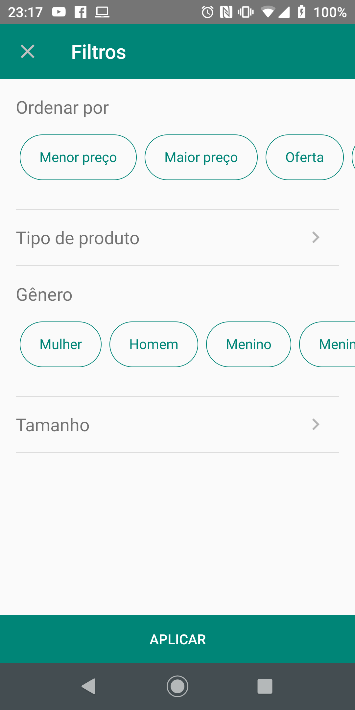
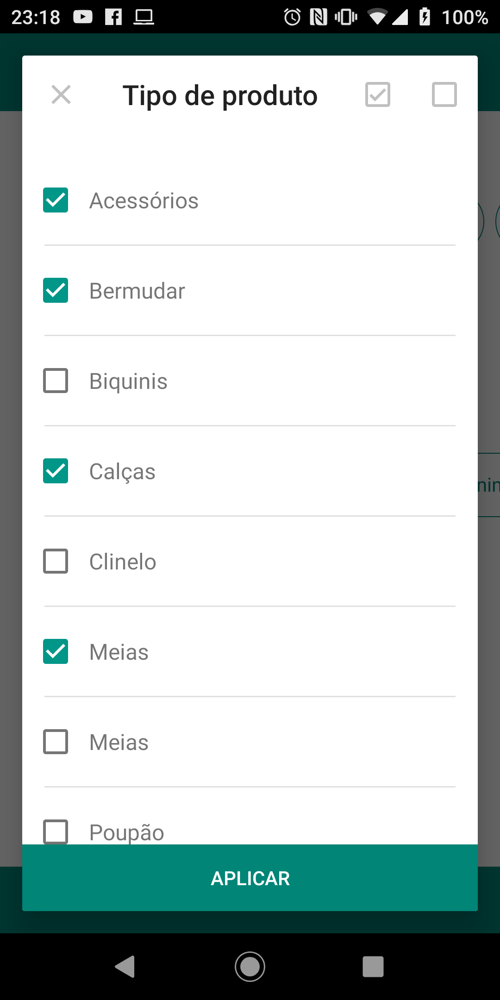
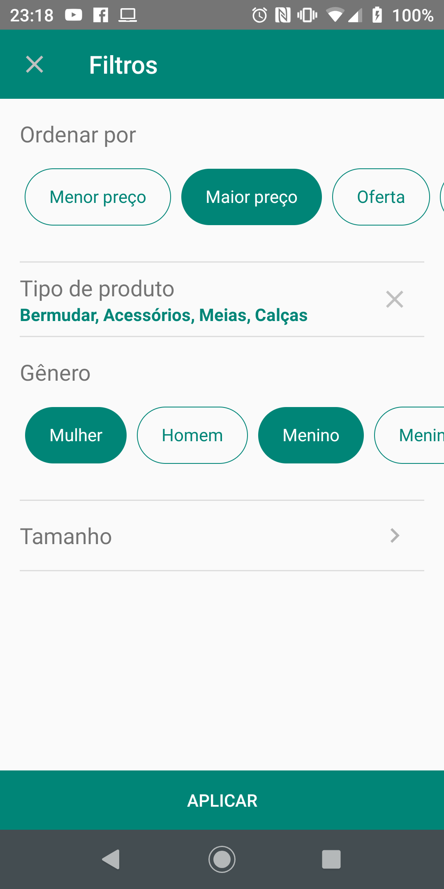
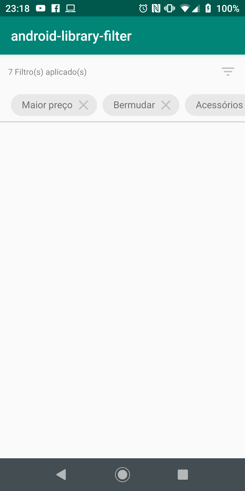

# android-library-filterview

#### A simple view to apply filters to your project.

<table>
    <td></td>
    <td></td>
    <td></td>

</table>
<table>
    <td></td>
    <td></td>
</table>

## Installation

```gradle
allprojects {
  repositories {
    ...
    maven { url 'https://jitpack.io' }
  }
}
```

```gradle
dependencies {
    implementation 'com.github.jheimes-silveira:android-library-filterview:${version}'
}
```


## Usage

### XML **The following XML attributes are supported:**
```xml
<br.com.jheimesilveira.js.filterview.FilterView
    android:id="@+id/filterView"
    android:layout_width="match_parent"
    android:layout_height="wrap_content"
    android:paddingStart="12dp"
    android:paddingLeft="12dp"
    
    app:js_dialog_background_color="@color/colorPrimary"
    app:js_dialog_icon_filter="@drawable/js_close_silver"
    app:js_dialog_text="@string/filters"
    app:js_dialog_text_color="@android:color/white"
    app:js_hint="@string/never_filter_apply"
    app:js_hint_color="@android:color/black"
    app:js_icon_filter="@drawable/js_filter_variant"
    />
```

### Kotlin simple usage

```kotlin
override fun onCreate(savedInstanceState: Bundle?) {
    super.onCreate(savedInstanceState)
    setContentView(R.layout.activity_main)

    val filterView = findViewById<FilterView>(R.id.filterView)

    val models = ArrayList<JSGroupFilterModel>()

    val model = JSGroupFilterModel("Ordenar por")
    model.dataSet = getDataSetOrderBy()
    models.add(model)

    filterView.loadDataSetFilter(models)
}

private fun getDataSetOrderBy(): ArrayList<JSItemFilterModel> {
    val model = ArrayList<JSItemFilterModel>()
    model.add(JSItemFilterModel("Menor preço", 1))
    model.add(JSItemFilterModel("Maior preço", 2))
    model.add(JSItemFilterModel("Oferta", 3))
    model.add(JSItemFilterModel("Mais vendidos", 4))
    model.add(JSItemFilterModel("Lançamanto", 5))

    return model
}
```

#### how to use JSGroupFilterModel
| variable | type | default | description |
|:---|:---|:---|:---|
| title | String |  `required` | Title of the filter group |
| dataSet | JSItemFilterModel |  `required` | An array of objects of type JSItemFilterModel will be loaded where each item is an option of a suitable filter that can be selected |
| type | enum | JSGroupFilterModel.Type.LINEAR | Defines the display mode of the component on the screen, where it supports: `LINEAR, GRID |
| multiple | Boolean |  `false` | Defines if you can choose multiple filters belonging to the same group |

#### how to use JSItemFilterModel
| variable | type | default | description |
|:---|:---|:---|:---|
| description | String |  `required` | Description that will be displayed on the screen |
| value | Any |  `null` | Can be passed any type of value to redeem the value later |
| group | Int | `self generated` | Auto generated field |


### Examples of methods in FilterView

```kotlin
/**
* Loads all Filter Models
* @param models Model
*/
filterView.loadDataSetFilter(models)

filterView.loadDataSetFilterSelected(
    // Index of the group to be Observed, where the index must be
    // greater than zero and less than the maximum value of groups
    indexGroup = 0
) {
    // In the function will be observed the group of filter options
    // in groupFilter and the group of filters already selected in
    // groupFilterSelected where you can edit the groupFilterSelected
    // object to add or remove filters in your dataSet
    groupFilter,
    groupFilterSelected ->

    //Returns to the function the new group of filters selected
    groupFilterSelected
}

/**
* Any changes made to the selected objects this method will be called
*/
filterView.onChangeModelSelected { listDataSetFilter, listDataSetFilterSelected, dataSet ->
    ...
}
```